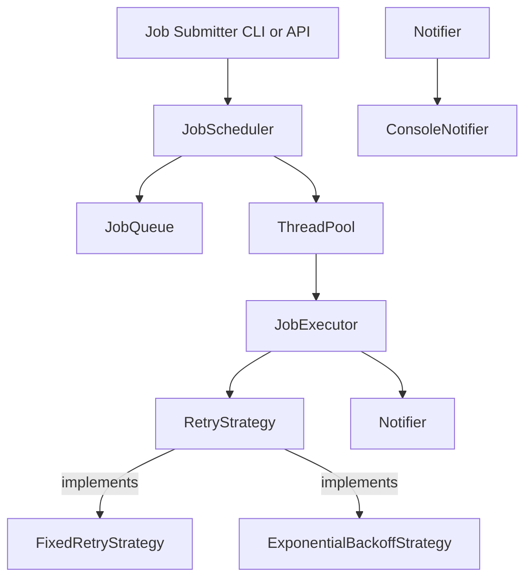
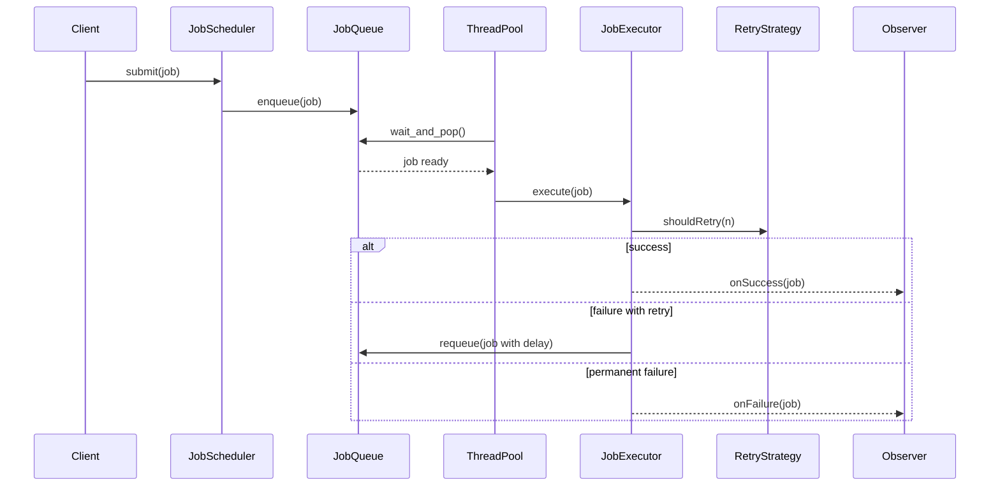

# ScheduleIt

A highi-performance multithreaded C++ job scheduler system with retry logic, backoff strategies, and clean architecture.

---

## Features

- **Job Scheduling**: Submit one-off or delayed jobs for execution.
- **Multithreaded Execution**: Thread pool powered execution using `std::thread`, `std::mutex`, and `condition_variable`.
- **Retry Strategies**: Built-in support for fixed retries and exponential backoff.
- **Failure Notifications**: Observer-based notification system for job results.
- **Clean Modular Architecture**: Uses SOLID principles and multiple design patterns.
- **Extensible**: Plug-and-play components for new retry, scheduling, or notification strategies.
- **Testable**: Designed with testability and unit testing in mind.

---

## System Overview

The system allows users to submit jobs, either from a CLI or programmatically. Each job includes a task, metadata, and optional delay. The scheduler places these jobs in a thread-safe priority queue, ordered by scheduled execution time.

A thread pool picks up jobs when they're due, executes them using the configured retry strategy, and notifies observers on success or failure.

---

## Architecture



---

## Job Lifecycle



---

## Core Components

- Job: Encapsulates a task with metadata including an ID, executable logic, retry policy, scheduled time, and max retries.
- RetryStrategy: Defines how and when jobs are retried, supporting both fixed delay and exponential backoff mechanisms.
- Notifier: Observes job results and responds to events; includes a ConsoleNotifier and is extensible to other output methods.
- ThreadPool: Oversees a pool of worker threads responsible for executing jobs concurrently.
- JobQueue: A thread-safe, time-prioritized queue that manages when jobs should be executed.
- JobScheduler: Central orchestrator that handles job submission, queueing, execution, retries, and observer notification.

---

## Design Patterns 

- **Strategy**: Retry logic encapsulated (e.g., backoff types)
- **Observer**: Job status notifications (success/failure)
- **Command**: Jobs as commands (e.g., lambdas/functions)
- **Thread Pool**: Worker management abstraction
- **Singleton**: Shared system components (e.g., Notifier)

---

## Clean Architecture Highlights

- Separation of concerns: Scheduler, Executor, RetryPolicy are independent.
- Decoupled subsystems using interfaces.
- Components are mockable and testable.
- Extension-friendly: add new strategies, notification systems, job types.


## Build Instructions

```bash
mkdir build && cd build
cmake ..
make
```

---

## How to Run

```bash
./scheduleit
```

Jobs can be submitted from the CLI, config files, or code. Sample jobs and configurations will be included in the `examples/` folder.

---

## Running Tests

To build and run tests:

```bash
mkdir build && cd build
cmake ..
make
ctest
```

## Inspiration

Modeled after real-world systems like:
- AWS Step Functions
- Celery (Python)
- Quartz Scheduler (Java)
